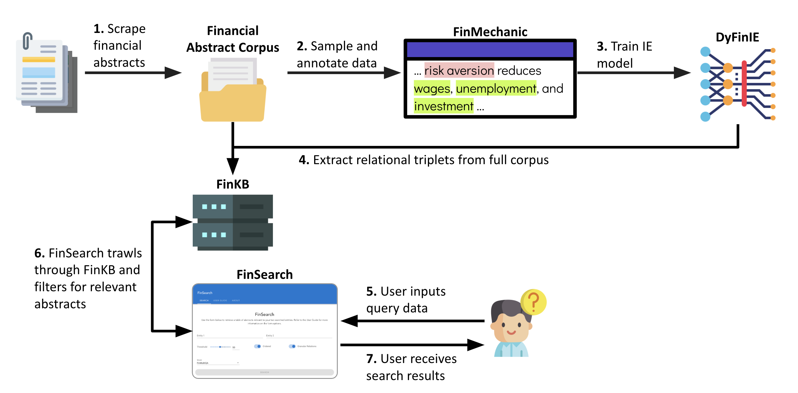

# Searchable Financial Knowledge Base
The work in this repository was done as part of my Final Year Project, with the objective to create a searchable financial knowledge base that can be easily utilised by users. Our search service, FinSearch, is temporarily hosted on [http://finsearch.surge.sh](http://finsearch.surge.sh) for demonstration.

For more details on the project, please refer to our report, [Constructing a Searchable Knowledge Base from Financial Text using Information Extraction](media/report.pdf).

## Project Pipeline

We provide the instructions and code for the following processes within our Pipeline:
1. Scraping financial abstracts from a variety of sources ([`financial_corpus`](financial_corpus/))
2. Data annotation of FinMechanic using Prodigy ([`prodigy`](prodigy/))
3. Training and evaluating a state-of-the-art information extraction model, DyFinIE ([`dyfinie`](dyfinie/))
4. Generation of Financial Knowledge Base using DyFinIE ([`finkb`](finkb/))
5. Setting-Up of FinSearch Service ([`finsearch`](finsearch/))
    - Separate Frontend ([`finsearch/finsearch_frontend/`](finsearch/finsearch_frontend/)) and Backend ([`finsearch/finsearch_backend/](finsearch/finsearch_backend/)) services
    - Training and Evaluation of Various Embedding Models ([`finsearch/finsearch_backend/embedder/embedding_models/`](finsearch/finsearch_backend/embedder/embedding_models/))

These instructions are provided within the README files of each respective section. For instance, instructions on deploying the FinSearch FrontEnd can be found at [`finsearch/finsearch_frontend/README.md`](finsearch/finsearch_frontend//README.md).

## Directory Structure
We structure our repository as follows:

    .
    ├── ...
    ├── financial_corpus                # Scraping abstracts and sampling for FinMechanic    
    │   ├── README.md                       # Instructions on running all scripts within financial_corpus
    │   ├── scrapers                        # Directory containing raw scrapers
    │   └── article_processing.py           # Processing and consolidating scraped abstracts
    ├── prodigy                        # FinMechanic and FinSemantic Data    
    │   ├── README.md                       # Instructions on utilising Prodigy
    │   ├── prodigy_formatting.py           # Formatting raw data to be accepted into Prodigy
    │   └── prodigy_processing.py           # Processing annotated data downloaded from Prodigy
    ├── dyfinie                         # DyFinIE model implementation
    │   ├── README.md                       # Instructions on training, predicting and evaluating IE models
    │   ├── finmechanic                     # FinMechanic dataset used to train DyFinIE
    │   ├── baselines                       # Baseline model prediction pipelines
    │   ├── dygiepp                         # Files to run DyFinIE tuning and prediction
    |   └── evaluation                      # Evaluation scripts for DyFinIE
    │       ├── ie_evaluation.py                # Evaluate information extraction capabilities
    |       └── ner_evaluation.py               # Evaluate named entity recognition capabilities
    ├── finkb                           # FinKB implementation
    │   ├── finkb_generation.py             # Script to generate predictions for FinKB
    |   └── finkb_analysis.py               # Evaluation scripts for FinKB
    ├── finsearch                       # FinSearch Service
    │   ├── README.md                       # Overview of FinSearch Architecture
    |   ├── finsearch_frontend              # FinSearch Frontend
    |   |   └── README.md                       # Set-up instructions for FinSearch Frontend
    │   └── finsearch_backend               # FinSearch Backend
    │       ├── querier                         # Querier Microservice
    |       |   └── README.md                       # Set-up instructions for Querier Microservice
    |       └── embedder                        # Embedder Microservice
    |           ├── README.md                       # Set-up instructions for Embedder Microservice
    |           ├── embedding_models                # Scripts to train embedding models
    |           ├── finkb_embeddings.py             # Generate embeddings for FinKB triplets
    |           ├── knn_graph_generation.py         # Generate KNN graphs on embeddings for search
    |           └── finsearch_embedder              # FinSerach embedder application
    ├── utils                           # Utilities folder for scripts
    └── ...

Notable READMEs with installation and execution instructions are highlighted within the dirctory structure.

## Built With
- Python 3.7
- Python Flask
- Vue.js

## Authors
Valary Lim Wan Qian - [Github](https://github.com/ValaryLim) | [Email](mailto:valarylim@outlook.com) | [LinkedIn](https://www.linkedin.com/in/valarylim/)

## License
Distributed under the MIT License. See [LICENSE.txt](LICENSE.txt) for more information.

## Contact
For questions or problems with the code, create a GitHub issue (preferred) or email [valarylim@outlook.com](mailto:valarylim@outlook.com).
